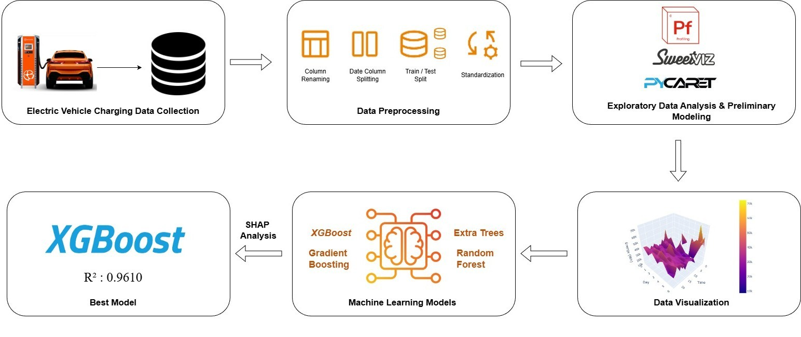
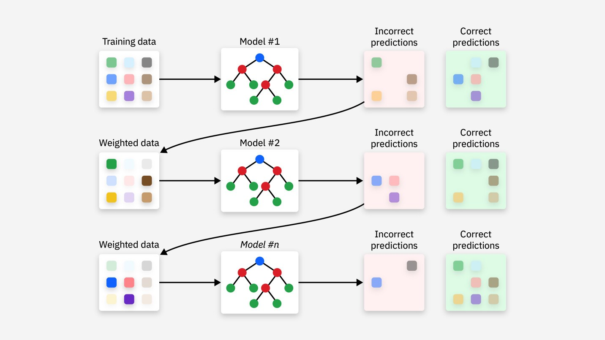
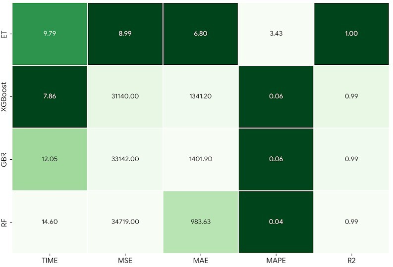
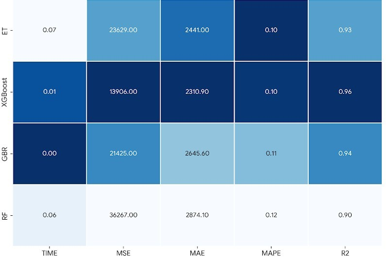

# 🔋 Energy Consumption Prediction in EV Charging Stations using Machine Learning

This repository presents a machine learning–based study focused on predicting **energy consumption during electric vehicle (EV) charging sessions** using real-world data collected from a Level-3 charging station. The study aims to support **efficient energy management**, **sustainable charging infrastructure**, and **data-driven decision-making** in smart mobility systems.

---

## 📊 Project Overview

- **Application Domain:** Electric Vehicle Charging Stations  
- **Problem Type:** Regression  
- **Target Variable:** Charged Energy (Wh)  
- **Best Performing Model:** XGBoost Regressor  
- **Explainability Method:** SHAP (SHapley Additive exPlanations)

---

## 🗂 Dataset Description

The dataset consists of real charging session data obtained from a Level-3 EV charging station located in Switzerland. It includes temporal variables, battery-related features, charging power characteristics, and state-of-charge (SoC) information.

Key variables include:
- Charging duration (Stay)
- Maximum charging power (Pmax)
- Battery energy capacity
- Arrival and departure SoC
- Temporal features (hour, day, weekday)

---

## 🔍 Exploratory Data Analysis

Exploratory analysis was conducted to understand the temporal and spatial distribution of energy consumption patterns. The following visualization illustrates how charging energy varies with respect to time and day.

---

## 🧪 Methodology

The overall workflow of the proposed approach is illustrated below. The pipeline consists of data preprocessing, feature engineering, model training, performance evaluation, and explainability analysis.

---

## 🧠 Machine Learning Models

Several regression algorithms were evaluated and compared:

- Extra Trees Regressor (ET)
- Random Forest (RF)
- Gradient Boosting Regressor (GBR)
- **XGBoost Regressor**

XGBoost outperformed other models due to its ability to model nonlinear relationships and complex feature interactions in EV charging data.

---

## 📈 Model Performance

Model performance was evaluated using **MSE, MAE, MAPE, and R²** metrics on both training and test datasets.

### 🔹 Training Performance

### 🔹 Test Performance

The XGBoost model achieved the highest R² score on the test set, indicating strong generalization capability and robustness.

---

## 🔎 Model Explainability with SHAP

To improve interpretability, SHAP analysis was applied to the XGBoost model. The results show that **charging duration (Stay)**, **maximum charging power (Pmax)**, and **battery energy capacity** are the most influential features affecting total energy consumption.

---

## 🌱 Sustainability Impact

Accurate prediction of EV charging energy consumption enables:
- Reduction of unnecessary energy usage
- Improved charging station capacity planning
- Support for sustainable energy management strategies

This study contributes to the development of **data-driven, explainable, and sustainable EV charging systems**.

---

## 🚀 Future Work

Future studies may integrate **driver behavioral patterns and charging preferences** to predict station occupancy and charging duration. Additionally, combining renewable energy availability and dynamic pricing strategies could further enhance sustainable charging operations.

---

## 📚 Reference

Lundberg, S. M., & Lee, S.-I. (2017). *A unified approach to interpreting model predictions*. Advances in Neural Information Processing Systems (NeurIPS).

---

**Zeynep Özer**  
Machine Learning • Energy Systems • EV Charging Analytics
